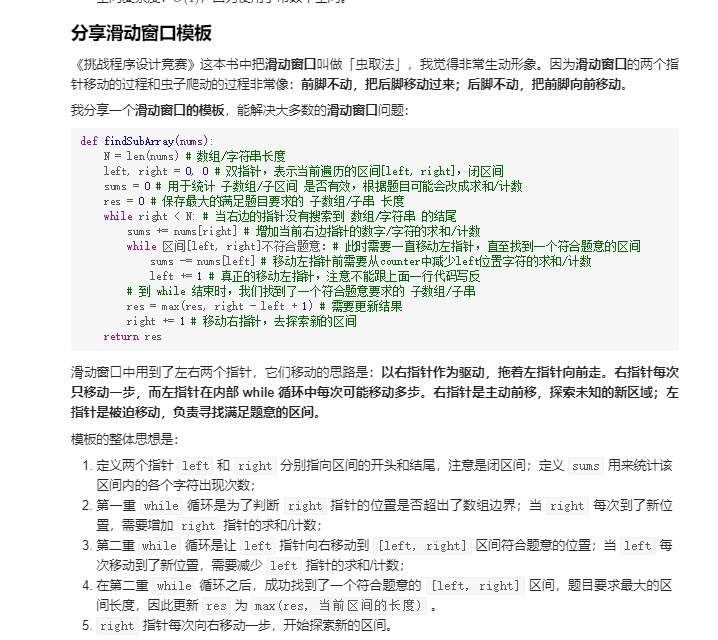

# 心得


## python3中自定义排序

比如leetcode 179 最大数

```python
import functools

def my_test():
    nums_str = ['92', '123', '929', '920']
    compare = lambda x, y: 1 if x + y < y + x else -1
    # nums_str.sort(cmp = compare)  # python2
    nums_str.sort(key=functools.cmp_to_key(compare)) # python3
    print(nums_str)

if __name__ == '__main__':
    my_test()
```


## python中记忆化递归

在 Python 中，有一个实现记忆化递归的神器，就是 functool模块的 lru_cache装饰器，它可以把函数的输入和输出结果缓存住，在后续调用中如果遇到了相同的输入，直接从缓存里面读。顾名思义，它使用的是 LRU （最近最少使用）的缓存淘汰策略。

`@functools.lru_cache(maxsize=None, typed=False)`

例 leetcode87:

```python
class Solution:
    @functools.lru_cache(None) 
    def isScramble(self, s1: str, s2: str) -> bool:
        N = len(s1)
        if N == 0: return True
        if N == 1: return s1 == s2

        if sorted(s1) != sorted(s2):
            return False

        for i in range(1, N):
            if self.isScramble(s1[:i], s2[:i]) and self.isScramble(s1[i:], s2[i:]):
                return True
            elif self.isScramble(s1[:i], s2[-i:]) and self.isScramble(s1[i:], s2[:-i]):
                return True

        return False

```


## 学习大佬的滑动窗口模板





```python
def findSubArray(nums):
    N = len(nums) # 数组/字符串长度
    left, right = 0, 0 # 双指针，表示当前遍历的区间[left, right]，闭区间
    sums = 0 # 用于统计 子数组/子区间 是否有效，根据题目可能会改成求和/计数
    res = 0 # 保存最大的满足题目要求的 子数组/子串 长度
    while right < N: # 当右边的指针没有搜索到 数组/字符串 的结尾
        sums += nums[right] # 增加当前右边指针的数字/字符的求和/计数
        while 区间[left, right]不符合题意：# 此时需要一直移动左指针，直至找到一个符合题意的区间
            sums -= nums[left] # 移动左指针前需要从counter中减少left位置字符的求和/计数
            left += 1 # 真正的移动左指针，注意不能跟上面一行代码写反
        # 到 while 结束时，我们找到了一个符合题意要求的 子数组/子串
        res = max(res, right - left + 1) # 需要更新结果
        right += 1 # 移动右指针，去探索新的区间
    return res

```


参考leetcode 2024


leetcode 713滑动窗口，首先要判断是滑动左边还是右边

## python 中的排序集合SortedSet

参考leetcode 220：

```python

```


## python中有序序列的查找可以使用bisect

参考同上的leetcode220:


## 二维列表的定义

```python
dp = [[0 for i in range(10)] for i in range(10)]       
```


## 堆排序

https://www.jianshu.com/p/801318c77ab5

参考leetcode313

```python
from queue import PriorityQueue as PQ

class Solution:
    def nthSuperUglyNumber(self, n: int, primes: List[int]) -> int:
        if n == 1:
            return 1

        num_map = {}
        heap = [1]

        for i in range(n):
            ugly = heapq.heappop(heap)
            for nu in primes:
                tmp = nu*ugly
                if tmp not in num_map:
                    num_map[tmp] = 1
                    heapq.heappush(heap, tmp)


        return ugly
```


可以对列表进行堆插入，但是列表数据顺序不变，只是pop弹出的时候是有顺序的


## c++优先队列 priority_queue

参考leetcode 786

priority_queue 是容器适配器

按照优先级出队，访问队首也是优先级高的元素

**用堆来存储的，用数组模拟的二叉树**, 有大顶堆 小顶堆, **默认是大顶堆**

插入，删除时间复杂度 O(logn)

访问: O(1)

头文件:`#incldue <queue>`

定义: `priority_queue<int>` que;  大顶堆

定义: `priority_queue<int, 容器, 比较方法>` 可以修改成小顶堆

定义: `priority_queue<int, vector<int>, greater<int> >que` ;  **小顶堆**


操作:

+ `que.size()`
+ `que.push()`
+ `que.pop()`
+ `que.top()` 访问堆顶元素
+ `que.empty()`

实例:

```cpp
#include <iostream>
#include <queue>
#include <vector>
#include <functional>
using namespace std;

struct node {
    int x, y;
    // 函数重载小于号
    bool operator< (const node &b) const {
        return this->x < b.x;
    }
};

struct node2 {
    int x, y;
};

struct cmp {
    bool operator() (const node2 &a, const node2 &b) {
        return a.x < b.x;
    }
};

int main() {
    // 自定类型
    // 自定义类型的排序规则需要自己写
    priority_queue<node> que2;
    que2.push((node){5, 6});
    que2.push((node){2, 9});
    que2.push((node){7, 5});
    while (!que2.empty()) {
        cout << que2.top().x << " " << que2.top().y << endl;
        que2.pop();
    }

    // 第二种重载方法
    priority_queue<node2, vector<node2>, cmp> que3;
    que3.push((node2){5, 6});
    que3.push((node2){2, 9});
    que3.push((node2){7, 5});
    while (!que3.empty()) {
        cout << que3.top().x << " " << que3.top().y << endl;
        que3.pop();
    }


    return 0;

    //priority_queue<int> que; // 大顶堆
    priority_queue<int, vector<int>, greater<int>> que; // 小顶堆
    que.push(6);
    que.push(2);
    que.push(5);
    que.push(9);
    que.push(8);
    cout << que.size() << endl;
    while (!que.empty()) {
        cout << que.top() << endl;
        que.pop();
    }


    return 0;
}
```


## python中同时遍历索引和内容

使用 enumerate,例:

```python
for i, score in enumerate(top_scores):
    print(i)
    print(score)
```


## c++function的使用

可以配合lamda表达式，在函数体内写函数

例leetcode 419:

```cpp
class Solution {
public:
    int countBattleships(vector<vector<char>>& board) {
        int m = board.size();
        int n = board[0].size();
        int dir[4][2] = {0, 1, 0, -1, 1, 0, -1 ,0};

        function<int(int, int)> dfs = [&](int x, int y) {
            if (x < 0 || y < 0 || x >= m || y >= n) return 0;
            if (board[x][y] == '.') return 0;
            board[x][y] = '.';

            for (int i = 0; i < 4; i++) {
                dfs(x + dir[i][0], y + dir[i][1]);
            }
            return 1;
        };

        int res = 0;
        for (int i = 0; i < m; i++) {
            for (int j = 0; j < n ; j ++) {
                res += dfs(i, j);
            }
        }

        return res;
    }
};
```


## c++ sort

对于vector的排序：

从小到大:

```cpp
vector<int>arr(s,s+5);
sort(arr.begin(),arr.end(),less<int>());
```

从大到小:

```cpp
vector<int>arr(s,s+5);
sort(arr.begin(),arr.end(),greater<int>());
```


## c++ emplace_back 比 push_back效率高

下面同样实现尾插的效果， emplace_back效率更高

```cpp
vector<vector<int>> ans;  

ans.emplace_back(initializer_list<int>{nums1[x], nums2[y]});
anp.push_back({nums1[x], nums2[y]})
```

例程： leetcode 373:

```cpp
class Solution {
public:
    vector<vector<int>> kSmallestPairs(vector<int>& nums1, vector<int>& nums2, int k) {
        auto cmp = [&nums1, &nums2](const pair<int, int> & a, const pair<int, int> & b) {
            return nums1[a.first] + nums2[a.second] > nums1[b.first] + nums2[b.second];
        };

        int m = nums1.size();
        int n = nums2.size();
        vector<vector<int>> ans;   
        priority_queue<pair<int, int>, vector<pair<int, int>>, decltype(cmp)> pq(cmp);
        for (int i = 0; i < min(k, m); i++) {
            pq.emplace(i, 0);
        }

        while (k-- > 0 && !pq.empty()) {
            auto [x, y] = pq.top(); 
            pq.pop();
            ans.emplace_back(initializer_list<int>{nums1[x], nums2[y]});
            if (y + 1 < n) {
                pq.emplace(x, y + 1);
            }
        }

        return ans;
    }
};


```


## c++ ctype 字符串操作

头文件：`#include <ctype.h>`

+ int islower(int c)		判断是否是小写字母
+ int isupper(int c)      判断是否是大写字母
+ int tolower(int c)       把大写字母转成小写字母
+ int toupper(int c)      把小写字母转成大写字母


## c++ pair

`pair<int, int> tmp;`

`auto x = make_pair(1, 2);`


## 参加考试 题目

快期中考试了，小开很紧张！现在各大网站上有 个比赛，每个比赛的开始、结束的时间点是知道的。

小开认为，参加越多的比赛，考试就能考的越好（假的）

所以，他想知道他最多能参加几个比赛。

由于小开认为如果要参加一个比赛必须善始善终，而且不能同时参加 个及以上的比赛。


思路，按照结束时间从小到大排序：

```cpp
#include <iostream>
#include <vector>
#include <algorithm>

using namespace std;

using P = pair<int,int>;

class Exam {
private:
    vector<P>_time;
    vector<int> _dfs;
    int exam_num;
    int _max;
public:
    Exam() {
        int s, e;
        cin >> exam_num;
        _max = 1;
        for (int i = 0; i < exam_num; i++) {
            cin >> s >> e;
            _time.emplace_back(make_pair(s, e));
            _dfs.emplace_back(0);
        }

        sort(_time.begin(), _time.end(), [](P a, P b){
            return a.second < b.second;
        });

        int temp = _time[0].second;
        for (int i = 0; i < exam_num; i++) {
            if (_time[i].first >= temp) {
                _max++;
                temp = _time[i].second;
            }
        }

    }

    ~Exam() {

    }

    int get_max() {
        return _max;
    }

};

int main() {
    Exam e;
    cout << e.get_max() << endl;

    return 0;
}
```


## c++ 从标准输入中读取一行数据到string中

c++:

```cpp
string buf;
getline(cin, buf);
```

在c中可以使用gets

```c
char buf[1024];
while (gets(buf)) {
  printf("%s\n", buf);
}
```


## c++ 从标准输入读到指定字符结束

比如读到`\n`就结束

```c++
#include <iostream>
using namespace std;

int main() {
  while (true) {
    string tmp;
    cin >> tmp;
    cout << tmp << endl;
    if (cin.peek() == '\n') {
      cin.ignore();
      break;
    }
  }
  
}
```


## 树状数组

关于各类「区间和」问题如何选择解决方案:

总结一下，我们应该按这样的优先级进行考虑：

1. 简单求区间和，用「前缀和」
2. 多次将某个区间变成同一个数，用「线段树」
3. 其他情况，用「树状数组」

参考leetcode 307

树状数组 多用于高效计算数列的前缀和， 区间和

所有的整数都可以表示成2的幂和，我们也可以把一串序列表示成一系列子序列的和


## 大数据中找数

数据量很大的情况下去寻找特定的数，一般可以考虑使用二分的思想去猜数，前提是这堆数是有序的

参考 leetcode 668


## c++自带的二分查找

参考: [(201条消息) C++二分函数（binary_search&lower_bound&upper_bound）_SkeletonKing233的博客-CSDN博客_c++ 二分函数](https://blog.csdn.net/SkeletonKing233/article/details/99479707)

+ 头文件:`#include <algorithm>`

+ `binary_search(a + begin, a + end, k, cmp);`

  + 必要条件：从a[begin]开始到a[end - 1]的序列是有序序列。

  + 功能：在数组a中从a[begin]开始到a[end - 1]按照cmp函数来**比较进行二分查找有没有一个数等于k**。

  + 返回值：如果有一个数等于k则返回值为true，否则为false
  + 参数：
    1. 首地址（a + begin） **必要**
    2. 末地址（a + end） **必要**
    3. 需要搜索的值 **必要**
    4. 比较函数表示序列如何有序（多数情况下适用于对结构体的搜索） **选要**

+ `lower_bound(a + begin, a + end, k, cmp);`

  + 必要条件：从a[begin]开始到a[end - 1]的序列是有序序列。
  + 功能：在数组a中从a[begin]开始到a[end - 1]按照cmp函数来比较进行二分**查找第一个大于等于k的数的位置**，如果有第一个大于等于k的数则返回该数的地址，否则返回a[end]的地址。
  + 返回值：地址。如果要转换为int，需减去数组a。
  + 参数：
    1. 首地址（a + begin） **必要**
    2. 末地址（a + end） **必要**
    3. 需要比较的值 **必要**
    4. 比较函数表示序列如何有序（多数情况下适用于对结构体的搜索） **选要**

  自定义比较方法, 参考leetcode354:

  ```c++
  struct cmp{
    bool operator() (const int &a, const int &b) {
      return a <= b;
    }
  };
  
  auto iter = lower_bound(dp.begin(), dp.end(), 10, cmp()); //注意cmp后面有一个括号
  
  if (iter == dp.end()) {
    cout << "not find" << endl;
  } else {
    cout << iter - dp.begin() << endl;  //索引
  }
  ```

+ `upper_bound(a + begin, a + end, k, cmp);`
  + 必要条件：从a[begin]开始到a[end - 1]的序列是有序序列。
  + 功能：在数组a中从a[begin]开始到a[end - 1]按照cmp函数来比较进行二分**查找第一个大于k的数的位置**，如果有第一个大于k的数则返回该数的地址，否则返回a[end]的地址。
  + 返回值：地址。如果要转换为int，需减去数组a。
  + 参数：
    1. 首地址（a + begin） **必要**
    2. 末地址（a + end） **必要**
    3. 需要比较的值 **必要**
    4. 比较函数表示序列如何有序（多数情况下适用于对结构体的搜索） **选要**
+ **upper_bound与lower_bound的本质区别是upper_bound是查找第一个大于k的元素位置，而lower_bound是查找第一个大于等于k的元素位置。**
+ 另外map,set支持使用二分方法，比如`auto it = mp.lower_bound(6); `


## 博弈题目

可以通过dfs遍历所有情况，并且找到一条判定对方必输的路，那么当前本方就可以走这条必赢的路。

参考464


## 设计一个哈希映射

思路： 数组加链表的数据结构

+ 数组通过下标的访问速度是o1的
+ 链表可以用于在hash冲突时，解决挂在同一数组下标的问题

参考 leetcode706:

```c++
class MyHashMap {
private:
    vector<list<pair<int, int>>> arr;
    static const int base = 769;
    static int hash(int key) {
        return key % base;
    }

public:
    MyHashMap(): arr(base) {
        
    }
    
    void put(int key, int value) {
        int idx = hash(key);
        for (auto iter = arr[idx].begin(); iter != arr[idx].end(); iter++) {
            if (iter->first == key) {
                iter->second = value;
                return;
            }
        }

        arr[idx].push_back(make_pair(key, value));
    }
    
    int get(int key) {
        int idx = hash(key);
        for (auto iter = arr[idx].begin(); iter != arr[idx].end(); iter++) {
            if (iter->first == key) {
                return  iter->second;
            }
        }

        return -1;
    }
    
    void remove(int key) {
        int idx = hash(key);
        for (auto iter = arr[idx].begin(); iter != arr[idx].end(); iter++) {
            if (iter->first == key) {
                arr[idx].erase(iter);
                return;
            }
        }
    }
};

/**
 * Your MyHashMap object will be instantiated and called as such:
 * MyHashMap* obj = new MyHashMap();
 * obj->put(key,value);
 * int param_2 = obj->get(key);
 * obj->remove(key);
 */
```


## 状态压缩dp

使用位(1/0)记录状态，再用动态规划，对状态进行递推

参考leetcode [5289. 公平分发饼干](https://leetcode.cn/problems/fair-distribution-of-cookies/)


## c++数据预初始化

leetcode是通过不断使用用例调用你写的类中方法去测试。 有一些预初始化的数据可以放在全局中初始化，这样避免了每次都调用接口去重新初始化数据，提高运行速度。

例 leetcode 10 爬楼梯:

```c++
#define MAX 46
int dp[MAX] = {0, 1, 2};
int init = [](){
    for (int i = 3; i < MAX; i++) {
        dp[i] = dp[i-1] + dp[i-2];
    }
    return 0;
}();

class Solution {
public:
    int climbStairs(int n) {

        return dp[n];
    }
};
```


## 单调栈和单调队列

> 单调栈

+ 单调递增栈： 栈中数据出栈的序列为单调递减序列；
+ 单调递减栈：栈中数据出栈的序列为单调递增序列。

维护单调递增栈：

- 遍历数组中每一个元素，执行入栈：每次入栈前先检验栈顶元素和进栈元素的大小。
- 如果栈空或进栈元素大于栈顶元素则直接入栈；如果进栈元素小于等于栈顶元素，则出栈，直至进栈元素大于栈顶元素。

作用：

**以O ( n ) O(n)O(n)时间复杂度求出某个数的左边或右边第一个比它大或小的元素。**

> 单调队列

队列中元素之间的关系具有单调性，而且**队首和队尾都可以进行出队操作，只有队尾可以进行入队操作。**

**维护单调队列**

队尾入队的时候维护单调性：

对于单调递增队列，设当前准备入队的元素为e，从队尾开始把队列中的元素逐个与e对比，把比e大或者与e相等的元素逐个删除，直到遇到一个比e小的元素或者队列为空为止，然后把当前元素e插入到队尾。
对于单调递减队列也是同样道理，只不过从队尾删除的是比e小或者与e相等的元素。


**作用：**

- 区间最小（最大）值问题。
- 优化动态规划：eg[优化多重背包](https://blog.csdn.net/Hanx09/article/details/108124918)


单调栈例题: leetcode 456:

这题单调栈需要从后往前遍历

```cpp
class Solution {
public:
    bool find132pattern(vector<int>& nums) {
        int n = nums.size();
        stack<int> stk;
        int val2 = INT_MIN;

        // 这题的单调栈从后遍历
        // 记录最后一个最大的2值，
        // 假设我们遍历的数是1值 
        // 因为初始化的时候2值为最小值，所以只有当2改变过，才有可能比2小
        // 只要遍历到的1值比2值小，则满足132模式
        // 当遍历到的值不满足比栈顶元素小，那么弹出栈顶元素，并记录弹出过的最大值作为2值
        // 保留在中的元素可以认为是3值

        for (int i = n-1; i >= 0; --i) {
            if (nums[i] < val2) return true;
            while (!stk.empty() && nums[i] > stk.top()) {
                val2 = max(val2, stk.top());
                stk.pop();
            }
            stk.push(nums[i]);
        }
        return false;
    }
};
```

